Haltech Patch Harness Mods
==========================

I needed to wire up the following on a new Haltech 1500 Elite CPU:

- Oil Pressure Sensor
- Fuel Pressure Sensor
- GM Throttle Pedal
- Bosch 82mm Electric Throttle

This FD has a 5 year old Rywire Harness, and I didn't want to spend another $1300 or so for a new harness for DBW.

That would have been much easier though.

The Rywire harness had the OMP harness on it. I guess I just forget to order it without the OMP, as this car has been strictly premix for years.

As long as it was there though, the 6 wires in the OMP harness were repurposed for the Fuel/Oil pressure sensors.

While this mod requires some modifications to the Haltech Patch box that fits between the Haltech Patch harness and the RX-7 engine harness, there were no hard modifications to existing harnesses.

That is, no wires were cut.

Between the OMP, the GM Pedal and the Bosch throttle body, a few wires were moved around in the harnesses.

The idea is to use 6 of the existing wires in the OMP wiring to supply +5v and sensor ground to the Oil/Fuel pressure sensors, and to get the signal back from the sensors.

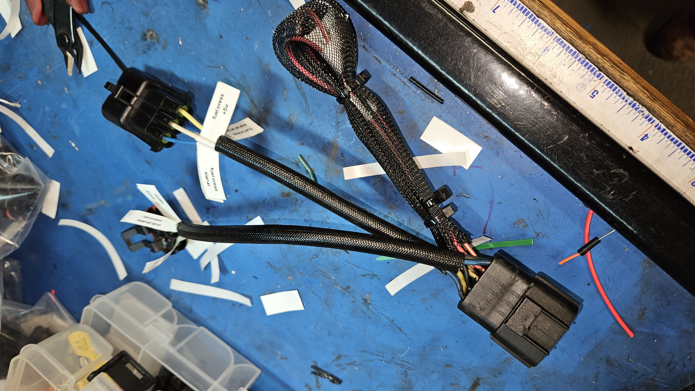

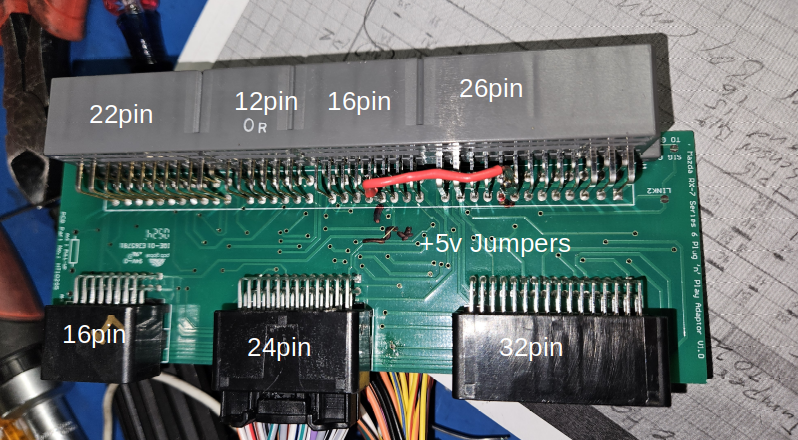

There are accompanying spreadsheets and photos of notes that provide further details for the wiring and pinning.

## ECU Signals

The Drive By Wire requires the use of these signals for DBW is _required_ for the Haltech Elite Series.

AVI2: TB TPS1
AVI3: TB TPS1
AVI4: Pedal App 1
AVI5: Pedal App 2

On Nexus ECUs, other AVI signals may be used.

The following ECU signals are used for the oil/fuel pressure signals, and are configured that way in the software.

AVI9: Oil Pressure
AVI10: Fuel Pressure

## +5V

Pins 5 and 6 of the the 26 pin connector of the engine harness side of the patch box are used to supply sensor +5v.

This was accomplished by jumpering together pins 5 and 6 on the 26 pin connector on the engine harness side of the box, to pin 9 of the 16 pin connector on the engine harness side.

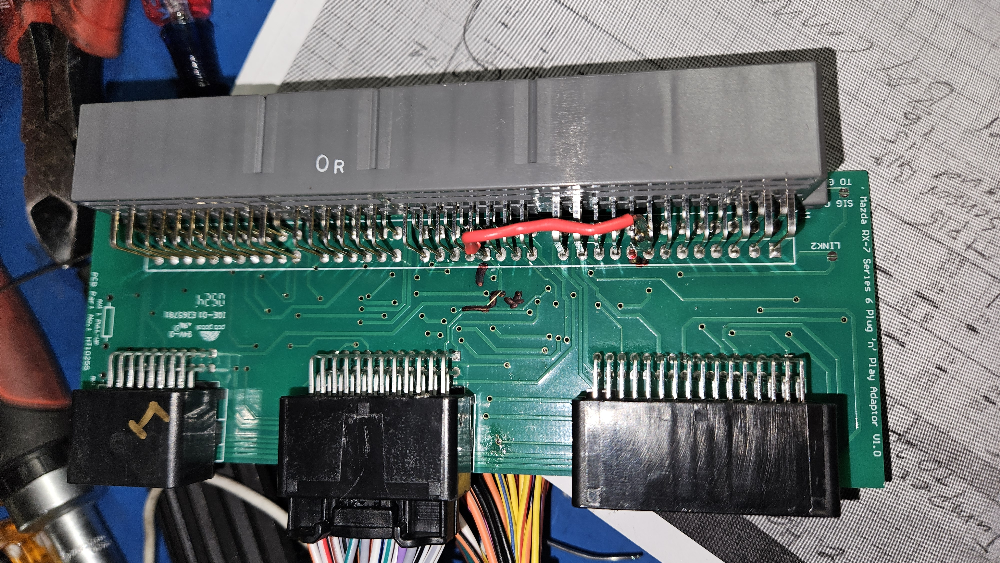

## Sensor Ground

Pins 18 and 19 the the 26 pin connector of the engine harness side of the patch box are used to supply sensor ground.

This was accomplished by jumpering together pins 17-19 on the 26 pin connector on the engine harness side of the box.

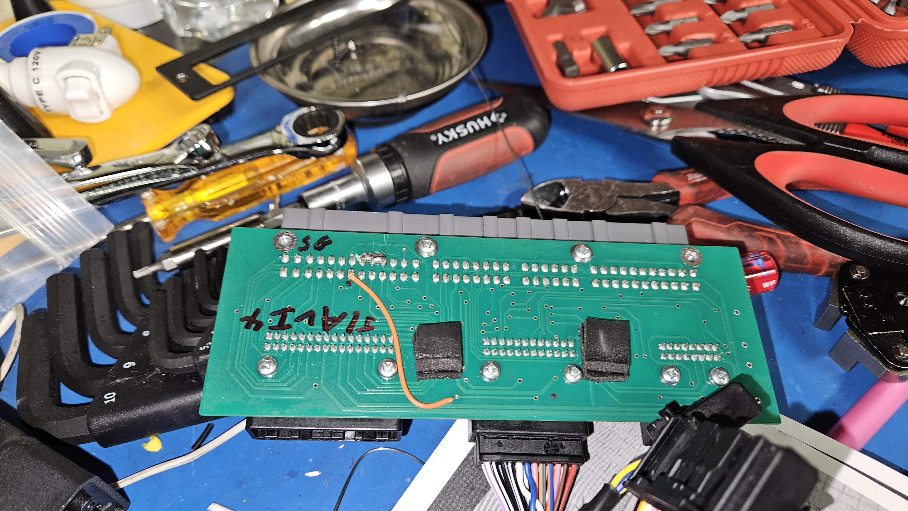

Please ignore the AVI4 reference in that picture, as it is incorrect.

## AVI9 - Oil Pressure

As the external MAP sensor is not used (internal to ECU), AVI9 was repurposed for the Oil Pressure Sensor.

## AVI 10 - Fuel Pressure

AVI 10 was previously used by the TPS (Throttle Position Sensor), and has been repurposed for the Fuel Pressure Sensor.

## Patch Harness Modifications

No wires were cut in any of the harnesses. Some wires were removed and replaced, a few were moved to different connectors and/or pins.

The Patch Harness box that allows connecting an FD harness to the Haltech ECU does some some modifications.

A few pins were jumpered for +5 and Ground, and I believe AVI4 was jumpered to a different pin.

Details are in the Spreadsheets and photos referenced earlier.

On modification to the Haltech Patch Harness was to remove the pin numbers 29-32 from the 32 pin connector that plugs into the Haltech side of the adapter box.

These are pins 5,6,18 and 19 on the 26 pin connector that plugs into the engine harness side of the adapter box

These pins correspond to pins 31-34 on the 34 pin connector that plugs in to the Haltech ECU.

These pins are used to control the OMP, and not necessary for my use.

## Results

The car has been started, and I verified that oil and fuel pressure were both being logged.

Getting all the wiring correct for the DBW was quite a chore.

The physical part is not so difficult - the hard part is determining which wires go where, and documenting it.

If I had to do it again, I just might buy another harness that is plug and play.

Thanks to [Reider357 for providing annotated connector drawings](https://www.rx7club.com/haltech-forum-62/haltech-elite-direct-fire-ait-sensor-1136840/#post12450549), these were very useful.

## Excel Files

## All Images

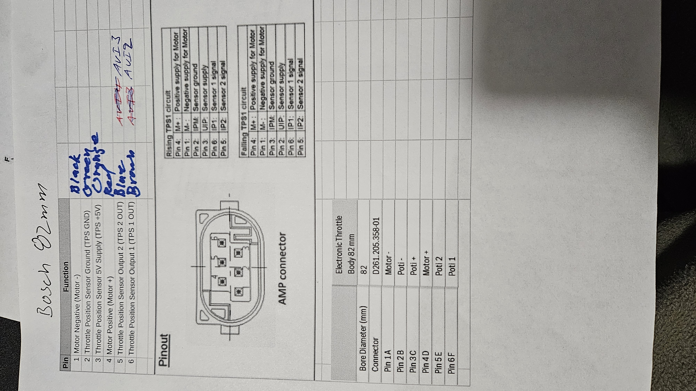
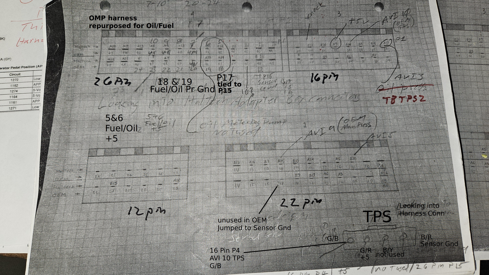
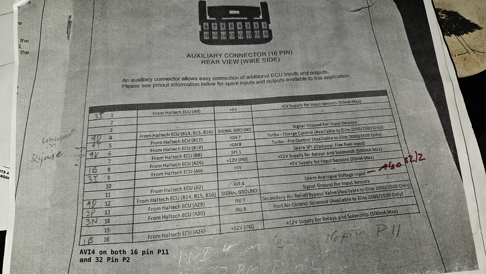
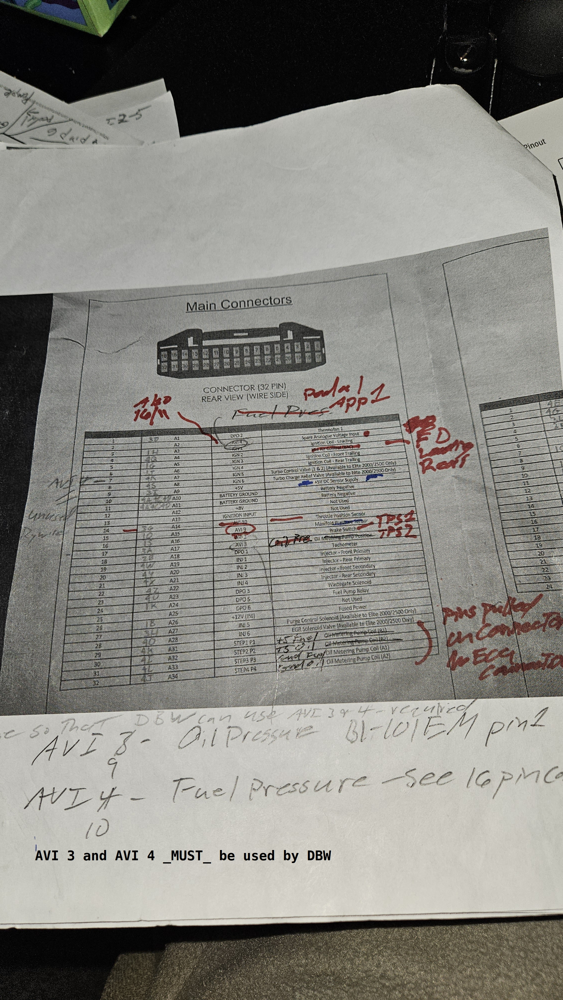

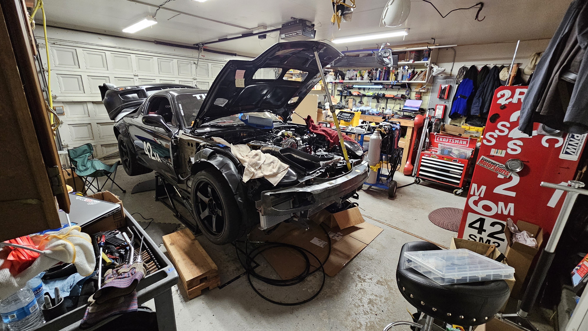
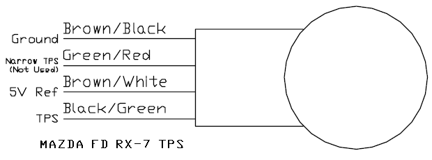
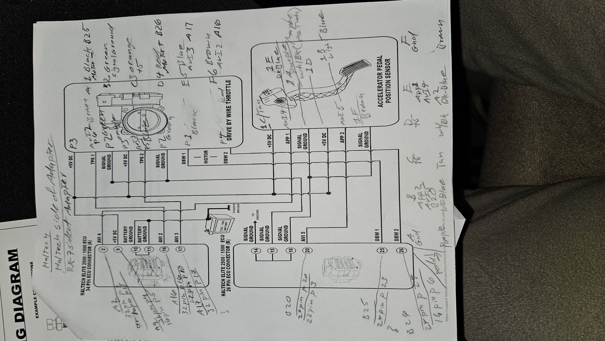
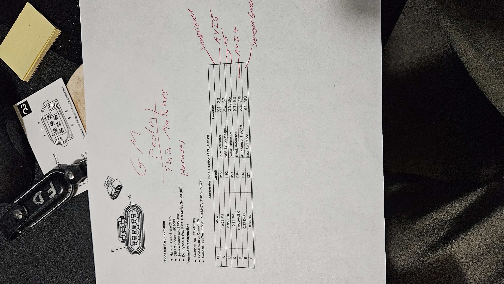
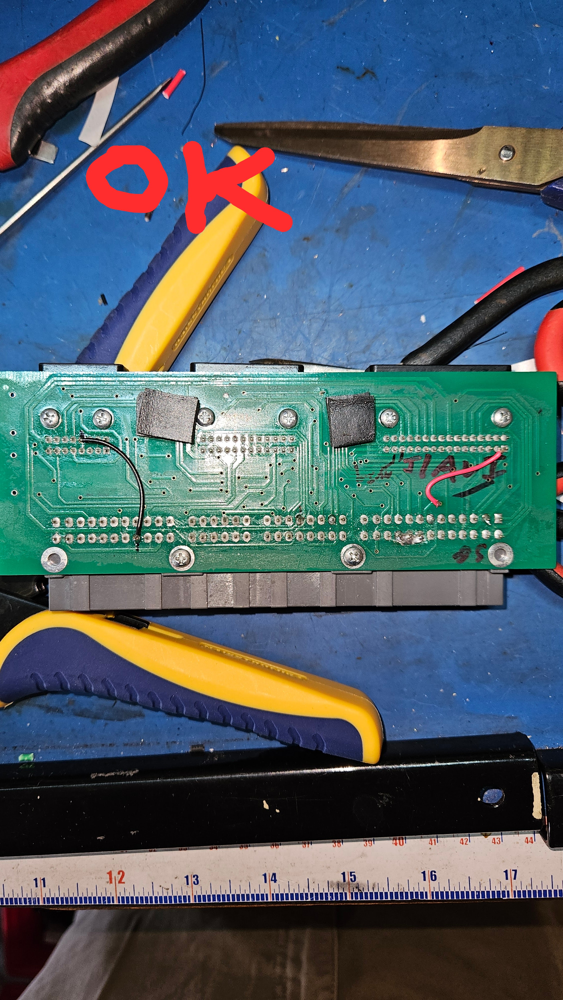
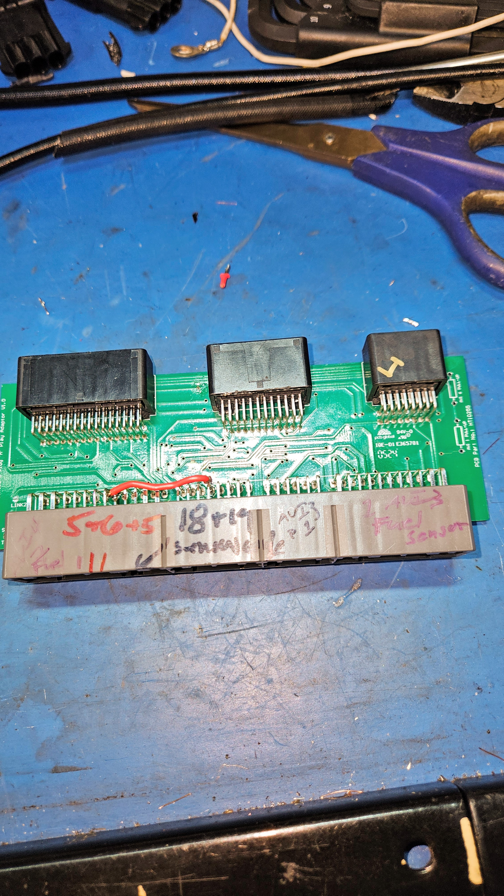

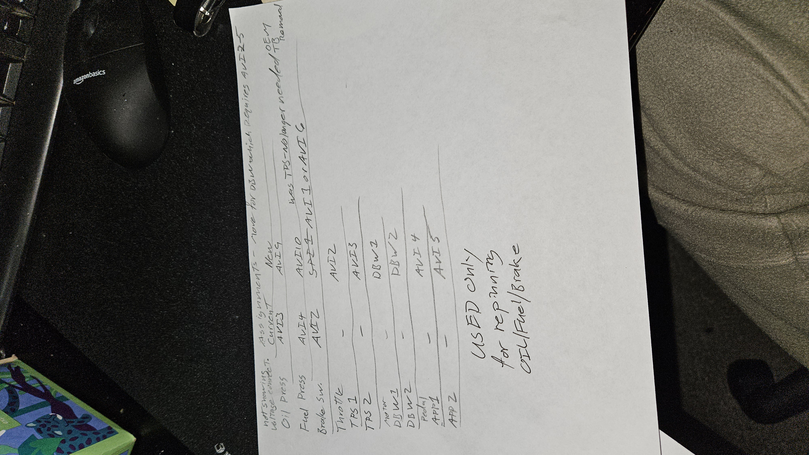
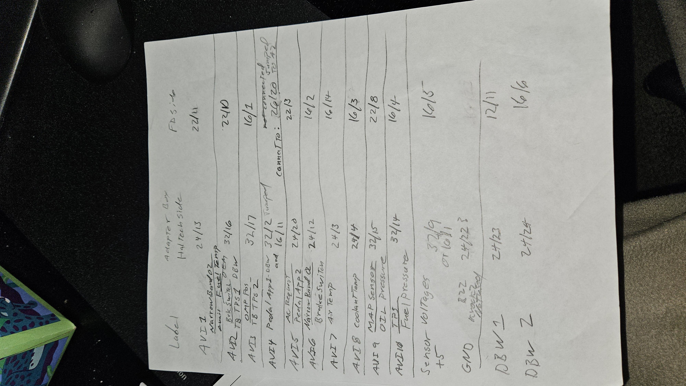

