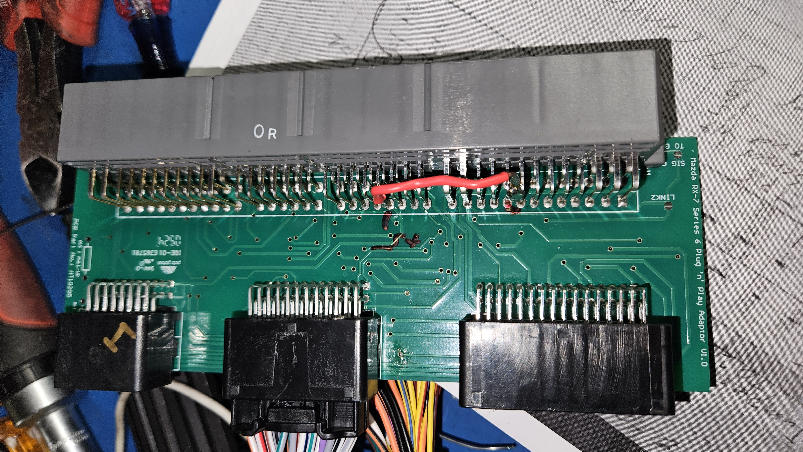
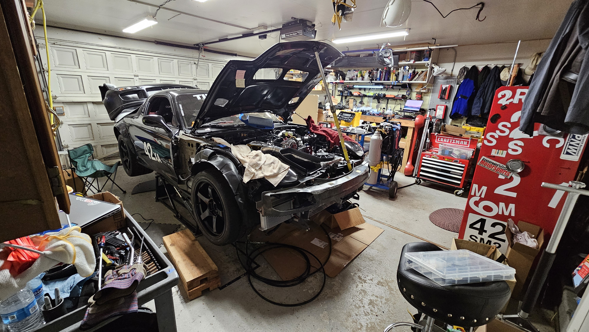

Haltech Patch Harness Mods
==========================

I needed to wire up the Oil and Fuel pressure sensors to the new Haltech 1500 Elite CPU.

Rather than run new wires, I used the existing OMP (Oil Metering Pump) connector on the Rywire harness.

Though I don't recall why I ordered the Rywire harness with OMP (no OMP in years), it seemed a good idea to just use the existing OMP wiring for the Oil/Fuel sensors.

While this mod requires some modifications to the Haltech Patch box that fits between the Haltech Patch harness and the RX-7 engine harness, there were no hard modifications to existing harnesses.

That is, no wires were cut, though 4 wires were removed from a connecter, and another was moved from one connector to another.

The idea is to use 6 of the existing wires in the OMP wiring to supply +5v and sensor ground to the Oil/Fuel pressure sensors, and to get the signal back from the sensors.

## ECU Signals

The following ECU signals are used for the oil/fuel pressure signals, and are configured that way in the software.

AVI3: Oil Pressure
AVI4: Fuel Pressure

## +5V

Pins 5 and 6 of the the 26 pin connector of the engine harness side of the patch box are used to supply sensor +5v.

This was accomplished by jumpering together pins 5 and 6 on the 26 pin connector on the engine harness side of the box, to pin 9 of the 16 pin connector on the engine harness side.

## Sensor Ground

Pins 18 and 19 the the 26 pin connector of the engine harness side of the patch box are used to supply sensor ground.

This was accomplished by jumpering together pins 17-19 on the 26 pin connector on the engine harness side of the box.

## AVI3 - Fuel Pressure

AVI3 corresponds to A17 on the 34 pin Haltech connector.  This pin is used by default for OMP position.

As there is no OMP, this wire was traced to the corresponding wire in the OMP connector, and connectedto the Fuel Pressure sensor.

## AVI4 - Oil Pressure

AVI4 appears in two places in the Haltech adapter box; as pin 11 the 16 pin connector on the Haltech side of the box, and as pin 2 on the 32 pin connector.

There is no wire in the 16 pin patch harness connector at position 11.  

On the adaptor circuit board, pin #7 of the 26 pin connector on the engine harness side was jumpered to pin #1 of 16 pin connector, also on the engine harness side of the box.

The wire in the OMP harness that corresponds to the oil pressure sensor wire was removed from the connector (sorry, I forgot to write down which connect/pin that was) and inserted into the pin #7 position of the 26 pin connector on the engine harness side of the box.

## Patch Harness Modifications

The only modification to the Haltech Patch Harness was to remove the pin numbers 29-32 from the 32 pin connector that plugs into the Haltech side of the adapter box.

These are pins 5,6,18 and 19 on the 26 pin connector that plugs into the engine harness side of the adapter box

These pins correspond to pins 31-34 on the 34 pin connector that plugs in to the Haltech ECU.

These pins are used to control the OMP, and not necessary for my use.

## Results

The car has been started, and I verified that oil and fuel pressure were both being logged.

## All Images

